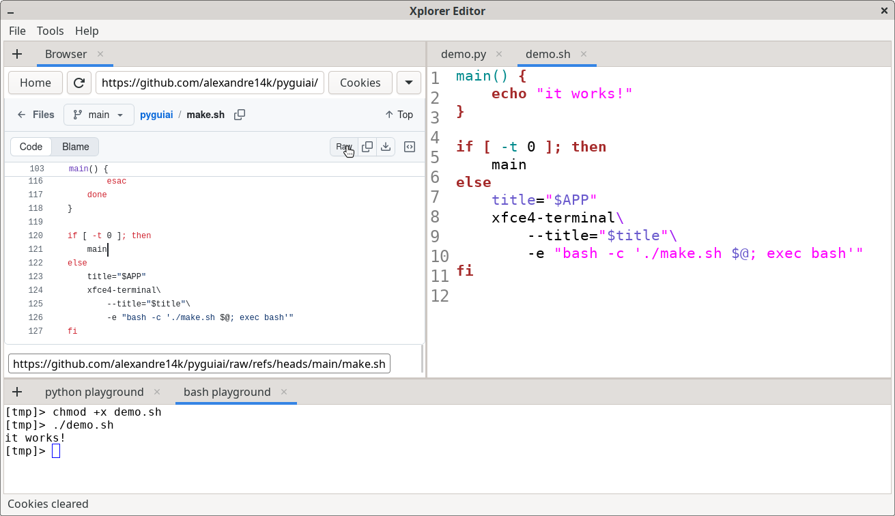

# Xplorer

A thoughtful, minimal editor built with GTK4, VTE, and WebKit.
Features an integrated terminal, web browser, and syntax highlighting.

## Architecture

A graphical application, much like a well-built city, requires distinct districts for its various functions.

To support split views, multiple tabbed environments, and system integration like themes and printing, we must separate concerns carefully.

Here is a more comprehensive arrangement. 
```bash
.
├── libs
│   ├── Actions
│   │   ├── Actions.cpp
│   │   ├── Actions.hpp
│   │   └── helper
│   │       ├── ActionsRegistrar.cpp
│   │       └── ActionsRegistrar.hpp
│   ├── Config
│   │   ├── Config.cpp
│   │   └── Config.hpp
│   ├── Context
│   │   ├── Context.cpp
│   │   └── Context.hpp
│   ├── Logger
│   │   ├── Logger.cpp
│   │   └── Logger.hpp
│   └── Ui
│       ├── Dialogs
│       │   ├── AboutDialog.cpp
│       │   ├── AboutDialog.hpp
│       │   ├── EditorSettingsDialog.cpp
│       │   ├── EditorSettingsDialog.hpp
│       │   ├── HelpDialog.cpp
│       │   ├── HelpDialog.hpp
│       │   ├── PrintDialog.cpp
│       │   ├── PrintDialog.hpp
│       │   ├── TerminalSettingsDialog.cpp
│       │   ├── TerminalSettingsDialog.hpp
│       │   ├── TerminalShellDialog.cpp
│       │   └── TerminalShellDialog.hpp
│       ├── helper
│       │   ├── UiFileHelper.cpp
│       │   └── UiFileHelper.hpp
│       ├── Menu
│       │   ├── MenuBar.cpp
│       │   └── MenuBar.hpp
│       ├── Ui.cpp
│       ├── Ui.hpp
│       ├── Views
│       │   ├── Browser.cpp
│       │   ├── Browser.hpp
│       │   ├── FileEditor.cpp
│       │   ├── FileEditor.hpp
│       │   ├── helper
│       │   │   ├── BrowserHelper.cpp
│       │   │   ├── BrowserHelper.hpp
│       │   │   ├── FileEditorHelper.cpp
│       │   │   └── FileEditorHelper.hpp
│       │   ├── Terminal.cpp
│       │   └── Terminal.hpp
│       └── Widgets
│           ├── SplitView.cpp
│           ├── SplitView.hpp
│           ├── TabManager.cpp
│           └── TabManager.hpp
├── ress
│   ├── resources.gresource.xml
│   └── xplorer.png
├── Xplorer.cpp
└── Xplorer.hpp
```

It borrows from the Unix philosophy of modularity, isolating the window manager, the individual views, and the actions that bind them together.

The Context module holds the shared application state, such as the current theme or window
dimensions. 

The Config module handles the persistence of these states to the disk, reading and writing user preference files.

We introduce Actions to manage GTK4 GActions.

This cleanly separates the logic of toggling line wrap or opening a file from the visual buttons themselves.

Inside the Ui module, we distinguish between Widgets, which are structural elements like the sliding split view and the tab manager.

Views contain the actual content rendering—the text editor, the embedded terminal, and browser.

Finally, Dialogs and Menu handle the transient and persistent interfaces, such as the about screen, print dialogs, and the top menu bar.

This structure allows you to debug a printing issue in PrintDialog without traversing the logic of your tab manager.

It is a quiet, orderly workspace.

## Prerequisites

Development libraries are required to proceed:
```bash
sudo apt install libgtk-4-1 \
                 libgtk-4-dev \
                 libwebkitgtk-6.0-dev \
                 libvte-2.91-gtk4-dev \
                 libgtksourceview-5-dev
```

## Building

Three scripts are provided for building and packaging:
```bash
- xplorer.sh -- required to build the program
- xdeb.sh -- required to build the debian package
- xprod.sh -- (optional) will create a standalone install with local linked dynamic libraries
```

Using **xplorer.sh**:
```bash
chmod +x xplorer.sh
./xplorer.sh
[b]uild [c]lean [r]un [d]ebug [s]pecs [k]lear [i]nit e[x]it > i
xmake already installed
[b]uild [c]lean [r]un [d]ebug [s]pecs [k]lear [i]nit e[x]it > b
building in release mode...
running: xmake f -o out -m release
checking for platform ... linux (x86_64)
running: xmake
[  3%]: <xplorer> cache compiling.release out/.gens/xplorer/linux/x86_64/release/gresource.c
[  3%]: <xplorer> cache compiling.release src/Xplorer.cpp
[  7%]: <xplorer> cache compiling.release src/libs/Ui/Dialogs/PrintDialog.cpp
[  7%]: <xplorer> cache compiling.release src/libs/Actions/helper/ActionsRegistrar.cpp
[  7%]: <xplorer> cache compiling.release src/libs/Actions/Actions.cpp
[  7%]: <xplorer> cache compiling.release src/libs/Ui/Dialogs/TerminalSettingsDialog.cpp
[  7%]: <xplorer> cache compiling.release src/libs/Ui/Dialogs/EditorSettingsDialog.cpp
[ 10%]: <xplorer> cache compiling.release src/libs/Ui/Dialogs/HelpDialog.cpp
[ 14%]: <xplorer> cache compiling.release src/libs/Ui/Dialogs/AboutDialog.cpp
[ 18%]: <xplorer> cache compiling.release src/libs/Ui/Dialogs/TerminalShellDialog.cpp
[ 21%]: <xplorer> cache compiling.release src/libs/Ui/Menu/MenuBar.cpp
[ 25%]: <xplorer> cache compiling.release src/libs/Ui/Ui.cpp
[ 29%]: <xplorer> cache compiling.release src/libs/Ui/Widgets/SplitView.cpp
[ 32%]: <xplorer> cache compiling.release src/libs/Ui/Widgets/TabManager.cpp
[ 36%]: <xplorer> cache compiling.release src/libs/Ui/helper/UiFileHelper.cpp
[ 40%]: <xplorer> cache compiling.release src/libs/Ui/Views/Terminal.cpp
[ 43%]: <xplorer> cache compiling.release src/libs/Ui/Views/Browser.cpp
[ 47%]: <xplorer> cache compiling.release src/libs/Ui/Views/helper/BrowserHelper.cpp
[ 51%]: <xplorer> cache compiling.release src/libs/Ui/Views/helper/FileEditorHelper.cpp
[ 54%]: <xplorer> cache compiling.release src/libs/Ui/Views/FileEditor.cpp
[ 58%]: <xplorer> cache compiling.release src/libs/Config/Config.cpp
[ 62%]: <xplorer> cache compiling.release src/libs/Logger/Logger.cpp
[ 65%]: <xplorer> cache compiling.release src/libs/Context/Context.cpp
[ 87%]: <xplorer> linking.release xplorer
[100%]: build ok, spent 17,394s
[b]uild [c]lean [r]un [d]ebug [s]pecs [k]lear [i]nit e[x]it > r
```

## Running

```bash
[b]uild [c]lean [r]un [d]ebug [s]pecs [k]lear [i]nit e[x]it > r
running: xmake run xplorer
[ 84%]: <xplorer> cache compiling.release out/.gens/xplorer/linux/x86_64/release/gresource.c
[ 87%]: <xplorer> linking.release xplorer
[ LOG ] Loading config...
[ LOG ] MenuBar Initialized
[ LOG ] SplitView Initialized
[ LOG ] SplitView Initialized

(xplorer:52636): Gtk-WARNING **: 00:48:17.183: No IM module matching GTK_IM_MODULE=ibus found
[ LOG ] Saving config...
MESA-INTEL: warning: ../src/intel/vulkan/anv_formats.c:949: FINISHME: support YUV colorspace with DRM format modifiers
MESA-INTEL: warning: ../src/intel/vulkan/anv_formats.c:981: FINISHME: support more multi-planar formats with DRM modifiers
```

<div style="text-align: center;">
  
</div>

## Packaging

```bash
chmod +x xdeb.sh
./xdeb.sh 
cleaning up old deb build directory...
copying binary...
copying icon...
creating desktop entry...
creating control file...
building .deb package to prod/...
dpkg-deb: construction du paquet « local.alexandre14k.xplorer » dans « prod/xplorer-editor_1.0.0_gcc-amd64.deb ».
cleaning up intermediate files...

done: prod/xplorer-editor_1.0.0_gcc-amd64.deb

install method: sudo apt install ./prod/xplorer-editor_1.0.0_gcc-amd64.deb

once done launch it from your app menu or by typing 'xplorer' in the terminal.

# as already installed the shell recognizes it and allows to call it
[xplorer]> xplorer 
[ LOG ] Loading config...
[ LOG ] MenuBar Initialized
[ LOG ] SplitView Initialized
[ LOG ] SplitView Initialized

(xplorer:53481): Gtk-WARNING **: 00:53:41.243: No IM module matching GTK_IM_MODULE=ibus found
[ LOG ] Saving config...
MESA-INTEL: warning: ../src/intel/vulkan/anv_formats.c:949: FINISHME: support YUV colorspace with DRM format modifiers
MESA-INTEL: warning: ../src/intel/vulkan/anv_formats.c:981: FINISHME: support more multi-planar formats with DRM modifiers
[xplorer]> 
```

## Icon

The `xplorer.png` icon is a resized and reduced size copy of the original file released as part of the public domain:
[SVG ID  20023](https://freesvg.org/vector-illustration-of-rocket-in-space-over-earth)

## License

SPDX-License-Identifier: AGPL-3.0-or-later
Copyright (C) 2026 Alexandre Raduly <alexander14k28@gmail.com>

This program is free software: you can redistribute it and/or modify
it under the terms of the GNU Affero General Public License as
published by the Free Software Foundation, either version 3 of the
License, or (at your option) any later version.

See [LICENSE](LICENSE) for the license governing this project.
